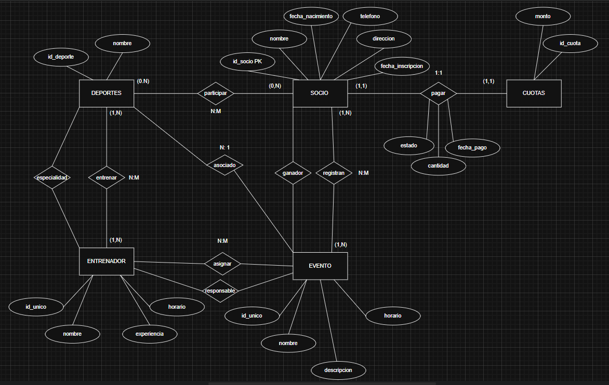

1. Diseñar el Modelo Entidad-Relación (ER):
Identifica las entidades, relaciones y atributos necesarios para cumplir
los requerimientos.
Define las cardinalidades de cada relación.
Incluye restricciones como claves primarias y claves foráneas.

2. Convertir al Modelo Relacional:
Transforma el modelo ER al modelo relacional con sus tablas y claves.
Especifica las claves primarias y foráneas.

CUOTAS (
    id_cuota INT PRIMARY KEY,
    monto DECIMAL,    
)
SOCIO (
    id_socio INT PRIMARY KEY,
    nombre VARCHAR (100),
    fecha_nacimiento DATE,
    telefono VARCHAR(20),  
    direccion VARCHAR(100)
    fecha_inscripcion DATE,
)
DEPORTE (
    id_deporte INT PRIMARY KEY, 
    nombre VARCHAR(100),
)
ENTRENADOR (
    id_unico INT PRIMARY KEY,
    nombre VARCHAR(100),
    experiencia INT,
    horario TIME,
)
EVENTO (
    id_unico INT PRIMARY KEY,
    nombre VARCHAR(100),
    descripcion VARCHAR(100),
    horario TIME,
)

3. Crear la Base de Datos:
Escribe los scripts en SQL para crear las tablas correspondientes con
las restricciones indicadas.

CREATE DATABASE IF NOT EXISTS ClubDeportivo;
USE ClubDeportivo;

CREATE TABLE Socios (
    id_socio INT AUTO_INCREMENT PRIMARY KEY,
    nombre_completo VARCHAR(100) NOT NULL,
    fecha_nacimiento DATE NOT NULL,
    telefono VARCHAR(20),
    direccion VARCHAR(255),
    fecha_inscripcion DATE NOT NULL
);

CREATE TABLE Disciplinas (
    id_disciplina INT AUTO_INCREMENT PRIMARY KEY,
    nombre VARCHAR(50) NOT NULL UNIQUE
);

CREATE TABLE Socios_Disciplinas (
    id_socio INT,
    id_disciplina INT,
    PRIMARY KEY (id_socio, id_disciplina),
    FOREIGN KEY (id_socio) REFERENCES Socios(id_socio) ON DELETE CASCADE,
    FOREIGN KEY (id_disciplina) REFERENCES Disciplinas(id_disciplina) ON DELETE CASCADE
);

CREATE TABLE Entrenadores (
    id_entrenador INT AUTO_INCREMENT PRIMARY KEY,
    nombre_completo VARCHAR(100) NOT NULL,
    experiencia_anios INT CHECK (experiencia_anios >= 0),
    horario_disponible TEXT
);

CREATE TABLE Entrenadores_Disciplinas (
    id_entrenador INT,
    id_disciplina INT,
    PRIMARY KEY (id_entrenador, id_disciplina),
    FOREIGN KEY (id_entrenador) REFERENCES Entrenadores(id_entrenador) ON DELETE CASCADE,
    FOREIGN KEY (id_disciplina) REFERENCES Disciplinas(id_disciplina) ON DELETE CASCADE
);

CREATE TABLE Eventos (
    id_evento INT AUTO_INCREMENT PRIMARY KEY,
    nombre VARCHAR(100) NOT NULL,
    descripcion TEXT,
    id_disciplina INT NOT NULL,
    fecha DATE NOT NULL,
    hora TIME NOT NULL,
    lugar VARCHAR(100) NOT NULL,
    id_ganador INT,  -- Puede ser NULL si no hay ganador aún
    FOREIGN KEY (id_disciplina) REFERENCES Disciplinas(id_disciplina),
    FOREIGN KEY (id_ganador) REFERENCES Socios(id_socio)
);

CREATE TABLE Socios_Eventos (
    id_socio INT,
    id_evento INT,
    PRIMARY KEY (id_socio, id_evento),
    FOREIGN KEY (id_socio) REFERENCES Socios(id_socio) ON DELETE CASCADE,
    FOREIGN KEY (id_evento) REFERENCES Eventos(id_evento) ON DELETE CASCADE
);

CREATE TABLE Eventos_Entrenadores (
    id_evento INT,
    id_entrenador INT,
    PRIMARY KEY (id_evento, id_entrenador),
    FOREIGN KEY (id_evento) REFERENCES Eventos(id_evento) ON DELETE CASCADE,
    FOREIGN KEY (id_entrenador) REFERENCES Entrenadores(id_entrenador) ON DELETE CASCADE
);

CREATE TABLE Pagos (
    id_pago INT AUTO_INCREMENT PRIMARY KEY,
    id_socio INT NOT NULL,
    fecha_pago DATE NOT NULL,
    monto DECIMAL(10, 2) NOT NULL CHECK (monto > 0),
    estado ENUM('pagado', 'pendiente', 'vencido') NOT NULL,
    FOREIGN KEY (id_socio) REFERENCES Socios(id_socio) ON DELETE CASCADE
);

4. Insertar Datos de Prueba:
Crea al menos:
- 5 socios.
- 3 entrenadores.
- 3 disciplinas deportivas.
- 2 eventos con al menos 2 participantes en cada uno.
Registra pagos de cuotas para los socios.

